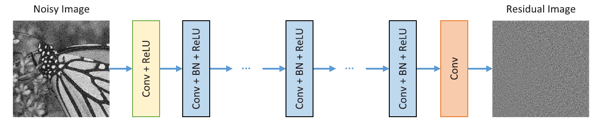

# DnCNN

The DnCNN Model proposed by [K Zhang et al. (2017)](../../../Papers/README.md) was created to be a single residual learning model to serve the task of [image de-noising][image-denoising-reflink], [single image super resolution][sisr-reflink] and [JPEG image deblocking][jpeg-imdeblocking-reflink].

[image-denoising-reflink]: https://uwaterloo.ca/vision-image-processing-lab/research-demos/image-denoising
[sisr-reflink]: https://in.mathworks.com/help/images/single-image-super-resolution-using-deep-learning.html
[jpeg-imdeblocking-reflink]: https://in.mathworks.com/help/images/jpeg-image-deblocking-using-deep-learning.html

In this folder, the `CDnCNN-B` model is implemented. This is the model used to specifically obtain the _blind color image denoising_ objective.

## Table of contents

- [DnCNN](#dncnn)
    - [Table of contents](#table-of-contents)
    - [Data](#data)
        - [Pipeline](#pipeline)
    - [Contents](#contents)
    - [Checkpoints](#checkpoints)
    - [References](#references)

## Data

The datasets used by the model above is [BSDS500](./../../../DataLoaders/README.md). Note that the model's goal is to do blind gaussian denoising (unknown variance parameter) for color images.

For **Testing**: BSD68, which is composed of 68 images from BSDS500 Validation split (originally 100 images), is used to test the model.

For **Training**: The remaining 432 (= 500 - 68) images are used for training.

### Pipeline

The following pipeline is used to generate **training data** from the images for training.

1. **AWGN**: White Gaussian Noise of levels from 0 to 55 (for sigma) is added
2. **Patches**: 128 * 3,000 patches are cropped, each of size 50 by 50 (128 batches, having 3000 patches each).

The above two steps are done through the [Pipelines](../../../Pipelines/README.md) module. Following this, the residual (noisy patch - clean patch) is extracted. The training data is composed of the noisy image patch and residual patch (many patches of size 50, 50, 3 each). The goal is to predict the noise.

At test time, we take the difference from the input image / patch to get the estimate of the clean patch.

## Contents

The contents of this folder are summarized as follows

| Item name | Description |
| :--- | :--- |
| [model.py](./model.py) | An experimental script (which works) to demonstrate the model, with full pipeline for training. Testing is currently on patches, not on images. |

## Checkpoints

| Checkpoint File | Timestamp | Description |
| :--- | :---- | :---- |
| [./checkpoints/24_nov_21/cp_5.ckpt](./checkpoints/24_nov_21/README.txt) | 21 November 2021 at 1:30 AM | Checkpoint of the initial model (stored in [./checkpoints/24_nov_21/model](./checkpoints/24_nov_21/model/)). For testing and further training purposes. The effects are actually visible despite using so little epochs. |
| [./checkpoints/4_dec_21_2/cp_50.ckpt](./checkpoints/4_dec_21_2/README.txt) | 4 December 2021 at 9:45 PM | The same model as in the checkpoint above, but trained for 65 epochs. |

## References

- GitHub repositories
    - [cszn/DnCNN](https://github.com/cszn/DnCNN): Original repository by the authors (link included in paper) implementing the DnCNN in MATLAB (using [MatConvNet](https://www.vlfeat.org/matconvnet/)) and Python (using [PyTorch](https://pytorch.org/))
    - [aGIToz/KerasDnCNN](https://github.com/aGIToz/KerasDnCNN): Implementing `DnCNN-S` (gaussian denoising with known parameters - sigma - on grayscale images) using Keras. Has the [Set12](https://github.com/aGIToz/KerasDnCNN/tree/master/Set12) images.
    - [wbhu/DnCNN-tensorflow](https://github.com/wbhu/DnCNN-tensorflow): Implementing DnCNN in tensorflow (version `1.4`). This is probably outdated since TensorFlow 1 is no longer supported.

